  
  
  

 

  

<h3 align="center">Tech Stack</h3>

  

 

<h3 align="center">What I Build</h3>

  

<h3 align="center">Activity</h3>

  

<picture>
  <source media="(prefers-color-scheme: dark)" srcset="https://raw.githubusercontent.com/ahmadrauf51/ahmadrauf51/output/snake-dark.svg" />
  <source media="(prefers-color-scheme: light)" srcset="https://raw.githubusercontent.com/ahmadrauf51/ahmadrauf51/output/snake-light.svg" />
  
</picture>

  

