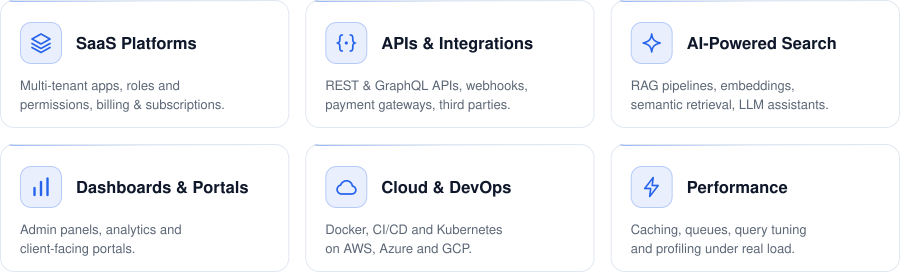

<a href="https://www.linkedin.com/in/ahmad-rauf-ar/">
  <picture>
    <source media="(prefers-color-scheme: dark)" srcset="./assets/hero-dark.svg" />
    <source media="(prefers-color-scheme: light)" srcset="./assets/hero-light.svg" />
    
  </picture>
</a>

  <a href="https://www.linkedin.com/in/ahmad-rauf-ar/">
    <picture>
      <source media="(prefers-color-scheme: dark)" srcset="https://img.shields.io/badge/LinkedIn-Connect-2563EB?style=for-the-badge&logo=linkedin&logoColor=white&labelColor=161B22" />
      
    </picture>
  </a>
  <a href="mailto:ahmadrauf51@yahoo.com">
    <picture>
      <source media="(prefers-color-scheme: dark)" srcset="https://img.shields.io/badge/Email-Say%20hello-2563EB?style=for-the-badge&logo=maildotru&logoColor=white&labelColor=161B22" />
      
    </picture>
  </a>
  

 

<picture>
  <source media="(prefers-color-scheme: dark)" srcset="./assets/about-dark.svg" />
  <source media="(prefers-color-scheme: light)" srcset="./assets/about-light.svg" />
  
</picture>

  

<h3 align="center">Tech Stack</h3>

  <picture>
    <source media="(prefers-color-scheme: dark)" srcset="https://skillicons.dev/icons?i=ts,js,php,python,react,nextjs,vue,nuxtjs,tailwind,nodejs,nestjs,express,laravel,symfony,graphql,mysql,postgres,mongodb,redis,elasticsearch,aws,azure,gcp,docker,kubernetes,nginx,linux,githubactions,git,jest,cypress,postman,figma&perline=11&theme=dark" />
    
  </picture>

 

<h3 align="center">What I Build</h3>

<picture>
  <source media="(prefers-color-scheme: dark)" srcset="./assets/services-dark.svg" />
  <source media="(prefers-color-scheme: light)" srcset="./assets/services-light.svg" />
  
</picture>

  

<h3 align="center">Activity</h3>

  <picture>
    <source media="(prefers-color-scheme: dark)" srcset="https://streak-stats.demolab.com?user=ahmadrauf51&background=0D1118&border=1E2531&ring=3B82F6&fire=60A5FA&currStreakNum=F3F5F8&sideNums=F3F5F8&currStreakLabel=60A5FA&sideLabels=8A94A3&dates=4E5766&stroke=1E2531&border_radius=14&card_width=900" />
    
  </picture>

<picture>
  <source media="(prefers-color-scheme: dark)" srcset="https://raw.githubusercontent.com/ahmadrauf51/ahmadrauf51/output/snake-dark.svg" />
  <source media="(prefers-color-scheme: light)" srcset="https://raw.githubusercontent.com/ahmadrauf51/ahmadrauf51/output/snake-light.svg" />
  
</picture>

  

<a href="https://www.linkedin.com/in/ahmad-rauf-ar/">
  <picture>
    <source media="(prefers-color-scheme: dark)" srcset="./assets/footer-dark.svg" />
    <source media="(prefers-color-scheme: light)" srcset="./assets/footer-light.svg" />
    
  </picture>
</a>
